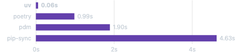

# UV package manager and installer
An extremely fast Python package and project manager, written in Rust.

## Highlights
Here's your list rewritten in a clean, formatted style — great for documentation, a slide, or a README:

---

## 🚀 Why Use `uv` – The All-in-One Python Tool

`uv` is a next-gen Python toolchain that replaces and accelerates your Python development workflow. Here’s what makes it powerful:

---

### 🌟 Core Features

* 🚀 **All-in-One Tooling**
  Replaces `pip`, `pip-tools`, `pipx`, `poetry`, `pyenv`, `twine`, `virtualenv`, and more — with a single binary.

* ⚡ **Blazing Fast**
  Up to **10–100x faster** than `pip`.

* 🗂️ **Project Management**
  Supports dependency resolution, universal lockfiles, and reproducible builds.

* ❇️ **Script Execution with Metadata**
  Easily run Python scripts with inline dependency declarations.

* 🐍 **Python Version Management**
  Installs and manages multiple Python versions, similar to `pyenv`.

* 🛠️ **Tool Runner**
  Run CLI tools published as Python packages without global installs.

* 🔩 **Pip-Compatible CLI**
  Familiar commands, with a huge performance boost.
* 🏢 **Workspace Support**
  Use **Cargo-style workspaces** for monorepos or multi-package projects.
* 💾 **Global Dependency Cache**
  Minimizes disk usage with deduplicated caching across projects.
* ⏬ **Simple Installation**
  No need for Python or Rust — install via `curl`, `pip`, or standalone binary.
* 🖥️ **Cross-Platform**
  Supports macOS, Linux, and Windows.
---

### 🔧 Backed by the Team Behind Ruff

Developed by **Astral**, the creators of the popular Python linter **Ruff** — focused on speed and developer experience.

